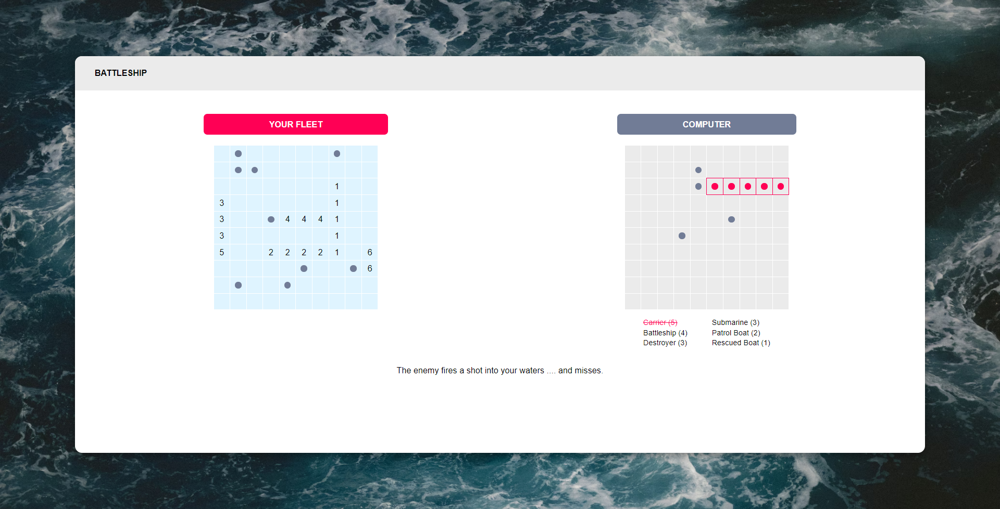

# battleship-game

The main objective of this project was to familiarize with TDD, (Test Driven Development) can certainly feel uncomfortable at first, but becomes more natural with practive. To do this I decided to implement the game 'Battleship'. Simply take it one step at a time. Write a test, then make it pass.
Here are the two files, which I wanted to test:
- gameboard.js
- ship.js

These two files are factory functions, and in this project I will not test everything, just these two files.
To do this I used the [Jest JS](https://jestjs.io/) test framework.

## Description

This application had to meet several requirements, which are the following:
1. Begin my app by creating the Ship factory function
  - 'Ships' will be objects that include their length, where they've been hit and wether or not they've been sunk.
  - Ships should be have a `hit()` function that takes a number and then marks that position as 'hit'
  - `isSunk()` should be a function that calculates it based on their length and whether all of their positions are 'hit'

2. Create Gameboard factory
  - Gameboard should be able to place ships at specific coordinates by calling the ship factory function.
  - Gameboards should have a `receiveAttack()` function that takes a pair of coordinates, determines whether or not the attach hit a ship and then send the `hit()` function to the correct ship, or records the coordinates of the missed shot.
  - Gameboards should keep track of missed attacks so they can display them properly.
  - Gameboards should be able to report whether or not all of their ships have been sunk.

3. Create Player
  - Players can take turns playing the game by attackings the ennemy Gameboard.
  - The game is played against the computer, so make ‘computer’ players capable of making random plays. The AI does not have to be smart, but it should know whether or not a given move is legal.

4. Create the main game loop and a module for DOM interaction
  - The game loop should set up a new game by creating Players and Gameboards.
  - You need methods to render the gameboards and to take user input for attacking. For attacks, let the user click on a coordinate in the enemy Gameboard.
  - The game loop should step through the game turn by turn using only methods from other objects.
  - Create conditions so that the game ends once one players ships have all been sunk.

All these instructions have been respected. The fact that I had to test my functions before writing them was quite confusing. But I have to admit that the fact to see these tests going little by little from red to green is very satisfying.
More seriously, knowing that my code is tested upstream allows me to be more serene in the progress of my project and quickly identify potential sources of error.

As for the technical stack of this project, it is a vanilla javascript project.
I decided to use [parcel](https://parceljs.org/) again which is a build tool for javascript projects. It's the second or third time I use it and I'm always satisfied. It allows me among other things to use [scss](https://sass-lang.com/) for my projects without configurations.
The project is hosted on [vercel](https://vercel.com), like all my projects so far.

I will update this readme for every change made to this project from now on. I'll come back to it, in the meantime I'm moving on. I can't wait to tackle React, but it was important before that to practice enough in vanilla JS. This is the last project before ReactJS, so let's go !



There are two new features that I will be incorporating next:
- [] polish the intelligence of computer by having it try adjacent slots after getting a hit
- [] letting users place their ships


## Deployed Link

You can follow this [link](https://battleship-game-theta.vercel.app/), to test it online.

## Install

If you want to test this app, you can clone the local repo and run it in your browser.

```bash
# git clone https://github.com/Celdama/battleship-game.git
# cd battleship-game
# npm install
# npm run start
# // and if you want to run test
# npm run test
```
## Technology Stack


## JavaScript Used

- DOM Manipulation
- Control Structure
- Function expression
- Factory Function
- Module Pattern
- import / export
- Object Event
- Event Listener
- Destructuring
- Method filter, find, sort, assign, push...
